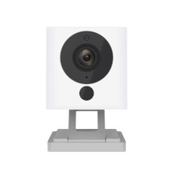
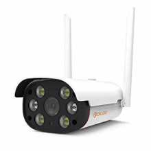

# OpenMiko

OpenMiko is a bootloader, kernel and toolchain for devices using Ingenic T10 and T20 SOC.

## Differences between this project and DaFang Hacks / OpenFang

This project is focused on providing a better foundation for developers and end users.
At the time of this project OpenFang was relatively quiet. DaFang Hacks has some activity
but I felt the way it was made was not necesssarily conducive to developing on a solid platform.

This project generously uses the code from both projects and it is much appreciated.

A few of the quality of life improvements in this project aimed at developers:

- A standardized toolchain based on [Buildroot](https://buildroot.org/)
- Docker image for development with precompiled artifacts available for download
- A compiled `uboot` based bootloader with USB ethernet and ext4. Load kernel images (`uImage.lzma`)
via TFTP for faster development.


## Overview

At the present time, this repository only contains kernel and rootfs for cameras using Inegnic T20 SOC. To ease identifying these cameras please use the pictures below. A more detailed technical description can be found [here](doc/overview.md).

Ingenic T20L (64Mb DDR) | &nbsp;
:-- | --:
 Xiaomi Mijia 2018 |  Xiaomi Xiaofang 1S

Ingenic T20N (64Mb DDR + SIMD128)
:-- |
 DIGOO DG W30

Ingenic T20X (128Mb DDR) | &nbsp;
:-- | --:
 Wyze Cam V2 | 
 Xiaomi Dafang |  Wyze Cam Pan

If you have a device with a Ingenic T10 SOC, consider using for now https://github.com/EliasKotlyar/Xiaomi-Dafang-Hacks

If you have a classic XiaoFang with a ARM-Processor, consider using https://github.com/samtap/fang-hacks

## Installation and Usage

Before installing OpenMiko, we suggest you carefully read the [FAQ](/doc/faq.md).

<!-- After that, continue to the [Installation](/doc/install.md) procedure. More details on [troubleshooting](doc/troubleshooting.md).
 -->

### 1. Flash the custom bootloader

Flashing the bootloader can be done a number of ways but generally require either a serial connection or existing shell access.


**WARNING - AN ERROR IN THIS STEP WILL BRICK YOUR DEVICE REQUIRING DESOLDERING TO RECOVER**


```
flash_erase /dev/mtd0 0 0
dd if=u-boot-lzo-with-spl.bin of=/dev/mtd0
```


### 2. Prepare a microsd card with the linux root file system


## On Mac OS


reading demo.bin

You need to use the `diskutility` command line. We need two partitions:

1. FAT32 (used for cross platform configuration and allowing the stock bootloader to read demo.bin)
2. EXT4 For the 2nd partition (or ExFAT and then overwrite with `dd`)

The second partition needs to be at least 250MB though that may change. Check the actual size of the `ext2` image.

`diskutil partitionDisk disk2 3 mbr fat32 EZCONFIG 2GB exfat rootfs 2GB "Free Space" freespace 0`


After partitioning `diskutil list` should show (I am using a 16GB microsd card):

```
/dev/disk2 (internal, physical):
   #:                       TYPE NAME                    SIZE       IDENTIFIER
   0:     FDisk_partition_scheme                        *15.9 GB    disk2
   1:                 DOS_FAT_32 EZCONFIG                2.0 GB     disk2s1
   2:               Windows_NTFS rootfs                  2.0 GB     disk2s2
```

### Overwrite the the rootfs parition with an ext4 image. We use `dd` for this.

`sudo dd if=rootfs.ext2 of=/dev/rdisk2s1 bs=64k`

Put the sdcard in the camera. Make sure all power is off to camera. Hold down the setup button while it is off and plug in the power. The blue LED will turn on. Do not cut power to the unit un


## Usage

Openfang is actively developed and releases are only provided when the openfang distribution is stable. If you want to test the development version you can easily compile it using [docker](https://www.docker.com/). More details on how to do it [here](doc/docker.md).

## Issues and support

If you encounter an issue which you think is a bug in the openfang or the associated libraries, you are welcome to submit it here on Github: https://github.com/anmaped/openfang/issues.

Please provide as much context as possible:

- buildroot core version which you are using;
- kernel version and modules you have enable;
- build root packages you are trying to integrate;
- when encountering an issue which happens at run time, attach serial output. Wrap it into a code block, just like the code;
- for issues which happen at compile time, enable verbose compiler output in the buildroot preferences, and attach that output (also inside a code block);
- development board model and brand;
- other settings (board choice, flash size, etc.).


## Contributing

Pull requests are welcome. For fixes of code and documentation, please go ahead and submit a pull request.

## License and Credits

This project is fork of https://github.com/anmaped/openfang/ which was no longer being actively
maintained.

Buildroot is developed and maintained by The Buildroot developers.
